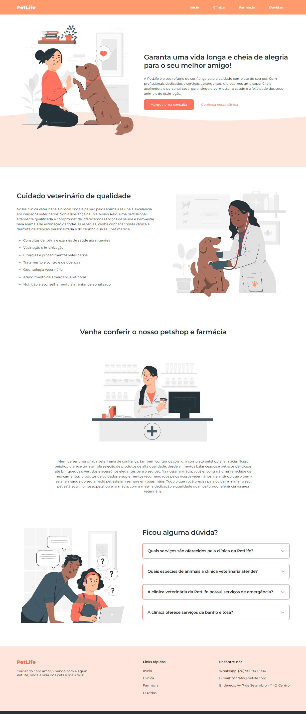

# 🐾 PetLife - Landing Page

## 📖 About the project

**PetLife** is a landing page built with HTML, CSS, and JavaScript for a fictional pet shop.
This project was developed during a basic programming course as a way to practice building institutional web pages focused on content presentation, layout structuring, and visual design.

## 🚀 Technologies

* HTML5
* CSS3
* JavaScript (basic)

## 🎯 Project goals

* Practice semantic HTML
* Improve page structuring skills
* Apply styling with CSS
* Build a professional-looking landing page

## 💡 Features

* Well-organized sections (about, services, contact, etc.)
* Clean and intuitive layout
* Structure focused on readability
* Simple interaction using JavaScript (basic function)

## 📱 Responsiveness

The project includes basic responsiveness for different screen sizes.

## 📸 Preview

## 🔗 Live Demo

[Access the project](https://santos-02.github.io/PetLife/)

## 🧠 What I learned

During this project, I practiced:

* HTML code organization
* Separation of concerns between HTML, CSS, and JavaScript
* Layout structuring
* Basic DOM manipulation with JavaScript
* Initial front-end best practices

---

Developed by João Lucas
